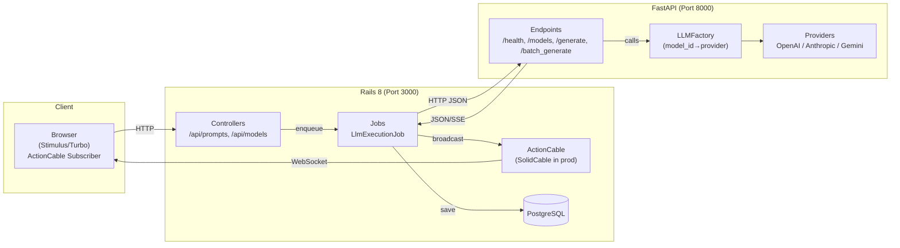
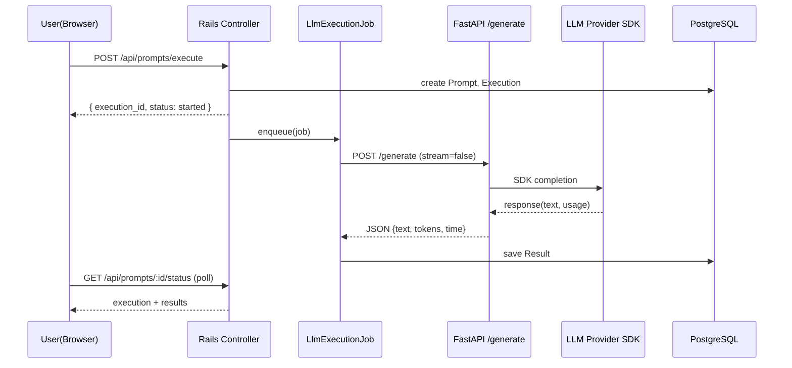
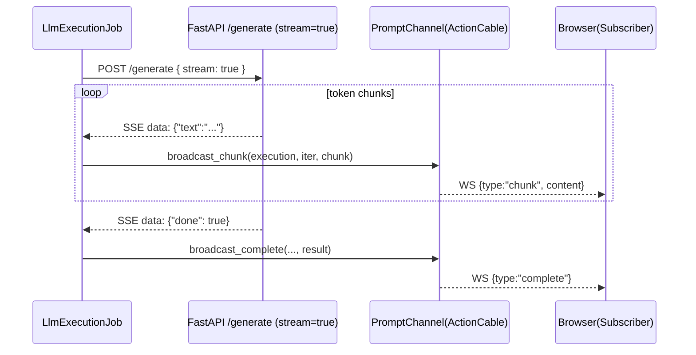
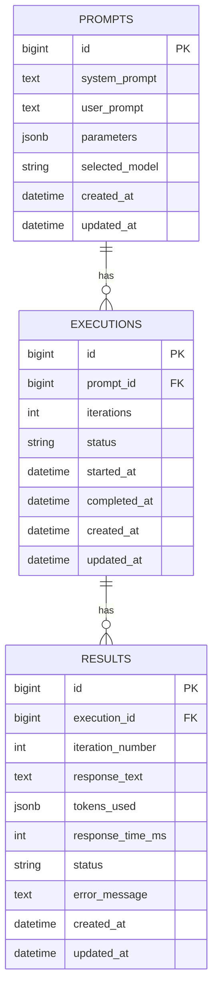

## 시스템 아키텍처

이 문서는 LLM API Playground의 컴포넌트, 데이터/스트림 흐름을 한눈에 이해할 수 있도록 “그림 + 짧은 설명”을 함께 제공합니다. 뷰어에 따라 Mermaid가 렌더링되지 않을 수 있어, ASCII 다이어그램도 함께 제공합니다.

---

### 1) 상위 구성도(Quick Visual)

ASCII 개요(어떤 뷰어에서도 보임)
```
┌─────────────── Browser ───────────────┐
│  Stimulus/Turbo  •  ActionCable Sub   │
└───────────────▲───────────┬──────────┘
                │WS         │HTTP
                │           │
┌───────────────┴───────────▼──────────┐
│          Rails 8 (Port 3000)         │
│  Controllers  Jobs  ActionCable  DB  │
│   (/api/*)   (LlmExecutionJob)       │
└───────────────┬───────────▲──────────┘
                │HTTP JSON  │SSE JSON
                │           │
┌───────────────▼───────────┴──────────┐
│         FastAPI (Port 8000)          │
│  /generate  /models  /health         │
│  LLMFactory → Providers(OpenAI/...)  │
└───────────────────────────────────────┘
```

Mermaid(지원 뷰어에서 시각화)


핵심 포트/프로토콜
- Rails 3000: HTTP, WebSocket(ActionCable)
- FastAPI 8000: HTTP(JSON), text/event-stream(SSE)
- PostgreSQL 5432

---

### 2) 비스트리밍 플로우(요청→응답)

Mermaid(시퀀스)


요점
- 사용자 요청은 즉시 `execution_id`로 응답하고, LLM 호출은 Job에서 비동기로 수행
- 결과는 DB에 저장되고, 클라이언트는 `status` API로 조회

---

### 3) 스트리밍 플로우(SSE + ActionCable)

Mermaid(시퀀스)


요점
- FastAPI가 `text/event-stream`으로 토큰 청크를 지속 전송
- Rails Job이 청크를 받아 ActionCable로 브라우저에 중계

---

### 4) 데이터 모델(ER)



인덱스 권장: `executions.prompt_id`, `results.execution_id, iteration_number` 복합 인덱스.

---

### 5) 주요 컴포넌트와 소스 매핑
- Rails
  - 컨트롤러: `app/controllers/api/prompts_controller.rb`, `app/controllers/api/models_controller.rb`
  - 잡: `app/jobs/llm_execution_job.rb`
  - 채널: `app/channels/prompt_channel.rb`
  - 서비스: `app/services/llm_models_service.rb`, `app/services/code_generator_service.rb`, `app/services/export_service.rb`, `app/services/api_key_manager.rb`
- Python
  - FastAPI: `lib/llm_api_server.py`
  - LLM 추상화: `lib/llm_services/base_llm.py`, `lib/llm_services/llm_factory.py`
  - 프로바이더: `openai_llm.py`, `anthropic_llm.py`, `gemini_llm.py`

---

### 6) 신뢰성/안전성
- FastAPI: 예외 처리, 4xx/5xx 구분, 지수 백오프 재시도(`BaseLLM.retry_with_exponential_backoff`)
- Rails: 잡 실패 시 `results.status=error` 저장 + `PromptChannel.broadcast_error`
- Gemini: Safety 차단 사유(숫자→의미) 매핑 및 사용자 피드백 제공

---

### 7) 성능/확장
- FastAPI 배치: `asyncio.gather`로 반복 실행 병렬화
- Rails 동시성: `config/queue.yml`로 스레드/프로세스 조절
- 스트림 UI: append-only 렌더링으로 비용 최소화
- 확장: 새 LLM 추가 시 Factory/Service/UI 메타만 증설(핵심 흐름 불변)

---

### 8) 운영/배포
- 포트/방화벽: 3000(Rails), 8000(FastAPI)
- CORS: Rails(3000) → FastAPI(8000) 허용(FastAPI CORS 미들웨어 설정)
- 헬스: Rails `/up`, FastAPI `/health`
- 프로세스: `bin/dev`(foreman) 또는 별도 프로세스/컨테이너 관리

---

### 9) 엔드포인트 요약
- Rails
  - POST `/api/prompts/execute`
  - GET `/api/prompts/:id/status`
  - GET `/api/prompts/:id/code`
  - GET `/api/prompts/:id/export`
  - GET `/api/models`
- FastAPI
  - GET `/health`, GET `/models`
  - POST `/generate` (stream 옵션)
  - POST `/batch_generate`

---

Tip: ASCII 개요도로 큰 흐름을 먼저 본 뒤, Mermaid 시퀀스로 세부 전달 단계를 확인하면 이해가 빠릅니다.


