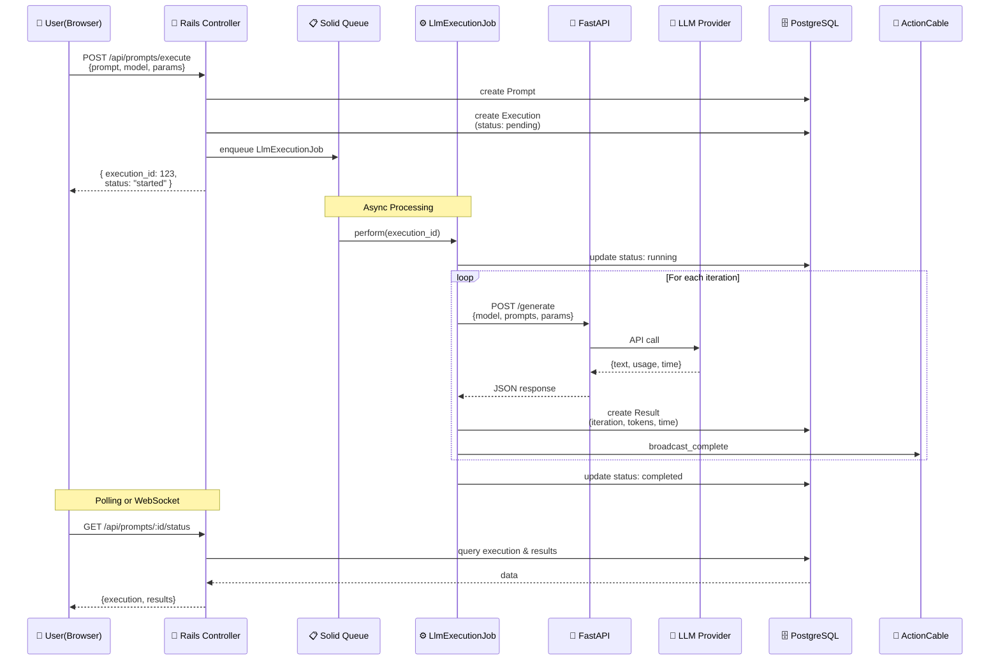
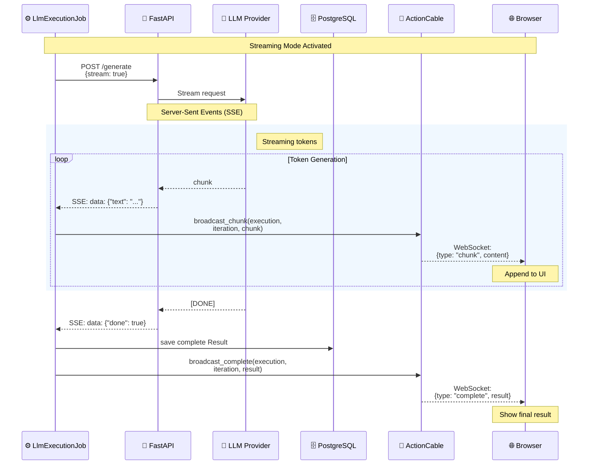
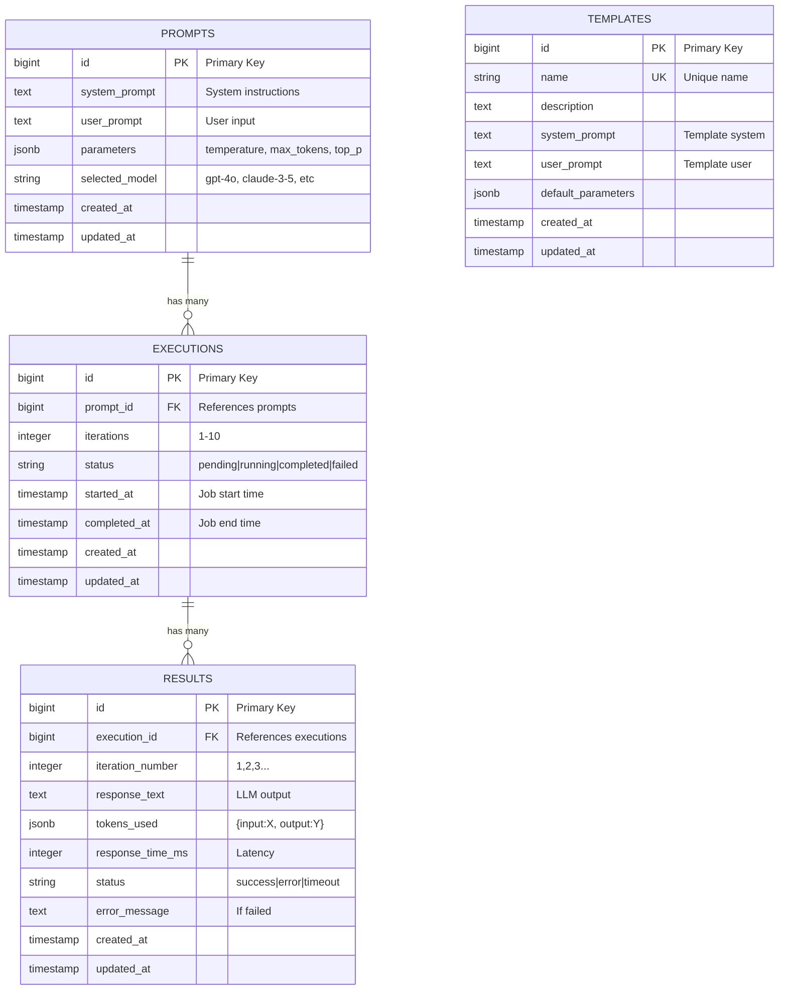

## 시스템 아키텍처

이 문서는 LLM API Playground의 시스템 구조를 시각적으로 설명합니다. ASCII와 Mermaid 다이어그램을 함께 제공하여 모든 환경에서 확인 가능합니다.

---

### 1) 전체 시스템 구성도

#### ASCII 다이어그램
```
┌─────────────────── Browser ──────────────────┐
│  Hotwire (Stimulus/Turbo)                    │
│  ActionCable WebSocket Subscriber            │
└───────────────▲───────────┬──────────────────┘
                │WS         │HTTP/JSON
                │           │
┌───────────────┴───────────▼──────────────────┐
│            Rails 8.0.2 (Port 3000)           │
│ ┌─────────────┐ ┌──────────┐ ┌─────────────┐│
│ │ Controllers │ │   Jobs   │ │ActionCable  ││
│ │ /api/prompts│ │LlmExecJob│ │PromptChannel││
│ │ /api/models │ │SolidQueue│ │(async/solid)││
│ └─────────────┘ └──────────┘ └─────────────┘│
│ ┌─────────────────────────────────────────┐ │
│ │         Services Layer                   │ │
│ │ ApiKeyManager | LlmModelsService        │ │
│ │ CodeGeneratorService | ExportService    │ │
│ └─────────────────────────────────────────┘ │
│ ┌─────────────────────────────────────────┐ │
│ │        PostgreSQL 16.x                   │ │
│ │  prompts | executions | results         │ │
│ └─────────────────────────────────────────┘ │
└───────────────┬───────────▲──────────────────┘
                │HTTP/JSON  │SSE
                │           │text/event-stream
┌───────────────▼───────────┴──────────────────┐
│          FastAPI 0.115.6 (Port 8000)         │
│ ┌─────────────────────────────────────────┐ │
│ │           API Endpoints                  │ │
│ │  /health | /models | /generate          │ │
│ │         /batch_generate                 │ │
│ └─────────────────────────────────────────┘ │
│ ┌─────────────────────────────────────────┐ │
│ │      LLM Service Layer                   │ │
│ │  LLMFactory | BaseLLM (Abstract)        │ │
│ └─────────────────────────────────────────┘ │
│ ┌─────────────────────────────────────────┐ │
│ │         LLM Providers                    │ │
│ │  OpenAILLM | AnthropicLLM | GeminiLLM   │ │
│ └─────────────────────────────────────────┘ │
└───────────────────────────────────────────────┘
                            │
                            ▼
        ┌─────────────────────────────────┐
        │      External LLM APIs         │
        │  OpenAI | Anthropic | Google   │
        └─────────────────────────────────┘
```

#### Mermaid 다이어그램
```mermaid
graph TB
  subgraph Browser["🌐 Browser"]
    B1["Hotwire (Stimulus/Turbo)"]
    B2["ActionCable WebSocket"]
  end

  subgraph Rails["🚂 Rails 8.0.2 (Port 3000)"]
    subgraph Controllers["Controllers"]
      C1["prompts_controller<br/>/api/prompts/*"]
      C2["models_controller<br/>/api/models/*"]
    end
    
    subgraph Jobs["Background Jobs"]
      J1["LlmExecutionJob<br/>(Solid Queue)"]
    end
    
    subgraph Channels["ActionCable"]
      CH1["PromptChannel<br/>(broadcast)"]
    end
    
    subgraph Services["Service Layer"]
      S1["ApiKeyManager"]
      S2["LlmModelsService"]
      S3["CodeGeneratorService"]
      S4["ExportService"]
    end
    
    subgraph Database["Database"]
      DB[(PostgreSQL 16<br/>prompts|executions|results)]
    end
  end

  subgraph Python["🐍 FastAPI 0.115.6 (Port 8000)"]
    subgraph Endpoints["API Endpoints"]
      E1["/health"]
      E2["/models"]
      E3["/generate"]
      E4["/batch_generate"]
    end
    
    subgraph LLMService["LLM Service Layer"]
      L1["LLMFactory"]
      L2["BaseLLM (ABC)"]
    end
    
    subgraph Providers["Provider Implementations"]
      P1["OpenAILLM"]
      P2["AnthropicLLM"]
      P3["GeminiLLM"]
    end
  end

  subgraph External["☁️ External APIs"]
    EX1["OpenAI API"]
    EX2["Anthropic API"]
    EX3["Google Gemini API"]
  end

  B1 -->|HTTP/JSON| C1
  B2 -.->|WebSocket| CH1
  
  C1 -->|enqueue| J1
  J1 -->|HTTP/JSON| E3
  E3 --> L1
  L1 --> L2
  L2 --> P1 & P2 & P3
  
  P1 --> EX1
  P2 --> EX2
  P3 --> EX3
  
  E3 -.->|SSE| J1
  J1 -->|save| DB
  J1 -->|broadcast| CH1
  
  C1 & C2 --> S1 & S2 & S3 & S4
  S1 & S2 & S3 & S4 --> DB
```

---

### 2) 비스트리밍 요청 플로우

#### ASCII 시퀀스
```
User        Rails Controller    LlmExecutionJob    FastAPI       LLM Provider    DB
 │               │                    │                │              │           │
 │─POST execute─>│                    │                │              │           │
 │               │───save prompt──────────────────────────────────────────────>│
 │               │───create execution─────────────────────────────────────────>│
 │<─{exec_id}───│                    │                │              │           │
 │               │──enqueue job──>    │                │              │           │
 │               │                    │                │              │           │
 │                                    │─POST /generate>│              │           │
 │                                    │  (stream=false)│              │           │
 │                                    │                │─API call────>│           │
 │                                    │                │<─response────│           │
 │                                    │<──JSON result──│              │           │
 │                                    │───save result─────────────────────────>│
 │                                    │                │              │           │
 │─GET status───>│                    │                │              │           │
 │               │───query DB─────────────────────────────────────────────────>│
 │<──results─────│<───────────────────────────────────────────────────────────│
```

#### Mermaid 시퀀스 다이어그램

```mermaid
sequenceDiagram
  participant U as 👤 User(Browser)
  participant RC as 🚂 Rails Controller
  participant Q as 📋 Solid Queue
  participant J as ⚙️ LlmExecutionJob
  participant F as 🐍 FastAPI
  participant L as 🤖 LLM Provider
  participant DB as 🗄️ PostgreSQL
  participant AC as 📡 ActionCable

  U->>RC: POST /api/prompts/execute<br/>{prompt, model, params}
  RC->>DB: create Prompt
  RC->>DB: create Execution<br/>(status: pending)
  RC->>Q: enqueue LlmExecutionJob
  RC-->>U: { execution_id: 123,<br/>status: "started" }
  
  Note over Q,J: Async Processing
  
  Q->>J: perform(execution_id)
  J->>DB: update status: running
  
  loop For each iteration
    J->>F: POST /generate<br/>{model, prompts, params}
    F->>L: API call
    L-->>F: {text, usage, time}
    F-->>J: JSON response
    J->>DB: create Result<br/>(iteration, tokens, time)
    J->>AC: broadcast_complete
  end
  
  J->>DB: update status: completed
  
  Note over U,RC: Polling or WebSocket
  
  U->>RC: GET /api/prompts/:id/status
  RC->>DB: query execution & results
  DB-->>RC: data
  RC-->>U: {execution, results}
```

**핵심 포인트**:
- 비동기 처리로 즉각적인 응답 제공
- 각 iteration별로 별도 Result 레코드 생성
- 완료 시 ActionCable로도 알림 (폴링 불필요)

---

### 3) 스트리밍 플로우 (SSE + ActionCable)

#### ASCII 시퀀스
```
LlmExecutionJob      FastAPI         LLM Provider    ActionCable     Browser
      │                 │                 │               │             │
      │─POST /generate─>│                 │               │             │
      │  stream=true    │                 │               │             │
      │                 │──async stream──>│               │             │
      │                 │                 │               │             │
      │<─SSE: data─────│<──chunk 1───────│               │             │
      │  {"text":"안녕"}│                 │               │             │
      │──broadcast_chunk───────────────────────────────>│             │
      │                 │                 │               │─WS: chunk──>│
      │                 │                 │               │             │
      │<─SSE: data─────│<──chunk 2───────│               │             │
      │  {"text":"하세요"}│                │               │             │
      │──broadcast_chunk───────────────────────────────>│             │
      │                 │                 │               │─WS: chunk──>│
      │                 │                 │               │             │
      │<─SSE: data─────│                 │               │             │
      │  {"done":true}  │                 │               │             │
      │──save to DB────>│                 │               │             │
      │──broadcast_complete──────────────────────────────>│             │
      │                 │                 │               │─WS: complete>│
```

#### Mermaid 스트리밍 다이어그램

```mermaid
sequenceDiagram
  participant J as ⚙️ LlmExecutionJob
  participant F as 🐍 FastAPI
  participant L as 🤖 LLM Provider
  participant DB as 🗄️ PostgreSQL
  participant AC as 📡 ActionCable
  participant B as 🌐 Browser

  Note over J,B: Streaming Mode Activated
  
  J->>F: POST /generate<br/>{stream: true}
  F->>L: Stream request
  
  Note over F,L: Server-Sent Events (SSE)
  
  rect rgb(240, 248, 255)
    Note right of L: Streaming tokens
    loop Token Generation
      L-->>F: chunk
      F-->>J: SSE: data: {"text": "..."}
      J->>AC: broadcast_chunk(execution,<br/>iteration, chunk)
      AC-->>B: WebSocket:<br/>{type: "chunk", content}
      Note over B: Append to UI
    end
  end
  
  L-->>F: [DONE]
  F-->>J: SSE: data: {"done": true}
  
  J->>DB: save complete Result
  J->>AC: broadcast_complete(execution,<br/>iteration, result)
  AC-->>B: WebSocket:<br/>{type: "complete", result}
  
  Note over B: Show final result
```

**기술적 특징**:
- **SSE (Server-Sent Events)**: FastAPI → Rails 단방향 스트림
- **WebSocket (ActionCable)**: Rails → Browser 양방향 통신
- **청크 단위 처리**: 토큰별로 즉시 UI 반영
- **누적 저장**: 스트림 완료 후 전체 텍스트 DB 저장

---

### 4) 데이터 모델 (Entity Relationship)

#### ASCII ER 다이어그램
```
┌─────────────────┐      ┌──────────────────┐      ┌─────────────────┐
│    PROMPTS      │      │   EXECUTIONS     │      │    RESULTS      │
├─────────────────┤      ├──────────────────┤      ├─────────────────┤
│ id (PK)         │──┐   │ id (PK)          │──┐   │ id (PK)         │
│ system_prompt   │  │   │ prompt_id (FK)   │  │   │ execution_id(FK)│
│ user_prompt     │  │   │ iterations       │  │   │ iteration_number│
│ parameters(JSON)│  │   │ status           │  │   │ response_text   │
│ selected_model  │  └──<│ started_at       │  └──<│ tokens_used(JSON)│
│ created_at      │      │ completed_at     │      │ response_time_ms│
│ updated_at      │      │ created_at       │      │ status          │
└─────────────────┘      │ updated_at       │      │ error_message   │
                         └──────────────────┘      │ created_at      │
                                                    │ updated_at      │
                                                    └─────────────────┘

┌─────────────────┐
│   TEMPLATES     │
├─────────────────┤
│ id (PK)         │
│ name            │
│ description     │
│ system_prompt   │
│ user_prompt     │
│ default_params  │
│ created_at      │
│ updated_at      │
└─────────────────┘
```

#### Mermaid ER 다이어그램

```mermaid
erDiagram
  PROMPTS ||--o{ EXECUTIONS : "has many"
  EXECUTIONS ||--o{ RESULTS : "has many"
  
  PROMPTS {
    bigint id PK "Primary Key"
    text system_prompt "System instructions"
    text user_prompt "User input"
    jsonb parameters "temperature, max_tokens, top_p"
    string selected_model "gpt-4o, claude-3-5, etc"
    timestamp created_at
    timestamp updated_at
  }
  
  EXECUTIONS {
    bigint id PK "Primary Key"
    bigint prompt_id FK "References prompts"
    integer iterations "1-10"
    string status "pending|running|completed|failed"
    timestamp started_at "Job start time"
    timestamp completed_at "Job end time"
    timestamp created_at
    timestamp updated_at
  }
  
  RESULTS {
    bigint id PK "Primary Key"
    bigint execution_id FK "References executions"
    integer iteration_number "1,2,3..."
    text response_text "LLM output"
    jsonb tokens_used "{input:X, output:Y}"
    integer response_time_ms "Latency"
    string status "success|error|timeout"
    text error_message "If failed"
    timestamp created_at
    timestamp updated_at
  }
  
  TEMPLATES {
    bigint id PK "Primary Key"
    string name UK "Unique name"
    text description
    text system_prompt "Template system"
    text user_prompt "Template user"
    jsonb default_parameters
    timestamp created_at
    timestamp updated_at
  }
```

**인덱싱 전략**:
- `executions.prompt_id` - 프롬프트별 실행 조회
- `results(execution_id, iteration_number)` - 복합 인덱스로 순서 보장
- `templates.name` - 유니크 인덱스로 중복 방지
- `executions.status` - 상태별 필터링 최적화 (선택)

---

### 5) 주요 API 엔드포인트

#### Rails API (Port 3000)
| Method | Endpoint | 설명 | 요청 예시 | 응답 예시 |
|--------|----------|------|----------|----------|
| POST | `/api/prompts/execute` | LLM 실행 요청 | `{prompt, model, params, iterations}` | `{execution_id, status}` |
| GET | `/api/prompts/:id/status` | 실행 상태 조회 | - | `{execution, results[]}` |
| GET | `/api/prompts/:id/code` | 코드 스니펫 생성 | `?language=python&iteration=1` | `{code, language}` |
| GET | `/api/prompts/:id/export` | 결과 내보내기 | `?format=json` | `{content, filename}` |
| GET | `/api/models` | 모델 목록 | - | `{models[], key_status}` |

#### FastAPI (Port 8000)
| Method | Endpoint | 설명 | 요청 예시 | 응답 예시 |
|--------|----------|------|----------|----------|
| GET | `/health` | 헬스체크 | - | `{status: "healthy"}` |
| GET | `/models` | 사용 가능 모델 | - | `{models: [...]}` |
| POST | `/generate` | LLM 생성 | `{model_id, prompts, params, stream}` | JSON or SSE |
| POST | `/batch_generate` | 병렬 배치 실행 | `{requests: [...]}` | `{results: [...]}` |

---

### 6) 기술 스택 및 버전

#### Backend
- **Rails 8.0.2**: API 서버, 백그라운드 잡, 실시간 통신
- **PostgreSQL 16.x**: 메인 데이터베이스 (JSONB 활용)
- **Solid Queue**: Active Job 어댑터 (DB 기반 큐)
- **Solid Cable**: ActionCable 어댑터 (운영 환경)
- **Solid Cache**: 캐싱 레이어

#### Frontend
- **Hotwire**: Stimulus 3.x + Turbo 8.x
- **Tailwind CSS 3.x**: 유틸리티 우선 스타일링
- **Importmap**: ES6 모듈 관리 (번들러 없음)

#### Python Service
- **FastAPI 0.115.6**: 비동기 웹 프레임워크
- **Uvicorn**: ASGI 서버
- **OpenAI SDK 1.57.0**: GPT 모델 통합
- **Anthropic SDK 0.41.0**: Claude 모델 통합
- **Google Generative AI 0.8.3**: Gemini 모델 통합

---

### 7) 보안 및 성능 최적화

#### 보안
- API 키: 환경 변수 관리 (`.env` 파일, 커밋 제외)
- CORS: localhost:3000만 허용 (FastAPI 미들웨어)
- CSP: Rails Content Security Policy 설정
- SQL Injection: Active Record ORM 사용
- XSS: Rails 자동 이스케이핑

#### 성능
- **비동기 처리**: FastAPI asyncio + Rails Active Job
- **연결 풀링**: PostgreSQL connection pool
- **동시성 제어**: Solid Queue 워커 수 조절
- **스트리밍 최적화**: 청크 단위 append-only 렌더링
- **재시도 전략**: 지수 백오프 (최대 3회, 2/4/8초)
- **캐싱**: Solid Cache + HTTP 캐시 헤더

#### 모니터링
- Rails: `/up` (내장 헬스체크)
- FastAPI: `/health` (커스텀 헬스체크)
- 로깅: Rails Logger + Python logging
- 메트릭: 응답 시간, 토큰 사용량 DB 저장

---

### 8) 배포 아키텍처

#### 개발 환경
```bash
# Foreman으로 전체 스택 실행
bin/dev

# 또는 개별 실행
rails server -p 3000
cd lib && uvicorn llm_api_server:app --port 8000
```

#### 운영 환경 (예시)
```
┌─────────────────────────────────────┐
│          Load Balancer              │
│         (Nginx/ALB/CloudFront)      │
└────────────┬────────────┬──────────┘
             │            │
    ┌────────▼───┐   ┌────▼────────┐
    │ Rails App  │   │ FastAPI App │
    │ (Port 3000)│   │ (Port 8000) │
    │ Container  │   │ Container   │
    └────────┬───┘   └─────────────┘
             │
    ┌────────▼───────────────────┐
    │    PostgreSQL 16 Cluster    │
    │   (Primary + Read Replica)  │
    └────────────────────────────┘
```

**배포 옵션**:
- Docker + Kubernetes
- Kamal (Rails 친화적)
- Heroku/Render/Fly.io
- AWS ECS/Fargate

---

### 9) 트러블슈팅 가이드

| 증상 | 원인 | 해결 |
|------|------|------|
| 403 Forbidden (FastAPI) | CORS 설정 | FastAPI CORS 미들웨어 origin 확인 |
| 스트리밍 안됨 | 프록시 버퍼링 | Nginx: `proxy_buffering off;` |
| ActionCable 연결 실패 | 케이블 어댑터 | development.rb의 `action_cable.url` 확인 |
| Job 실행 안됨 | Queue 워커 | `bin/jobs` 실행 확인 |
| Gemini 한국어 차단 | Safety 필터 | 프롬프트 수정 또는 필터 조정 |

---

이 아키텍처 문서는 시스템의 전체 구조를 한눈에 파악할 수 있도록 시각적 다이어그램과 상세 설명을 균형있게 제공합니다.


