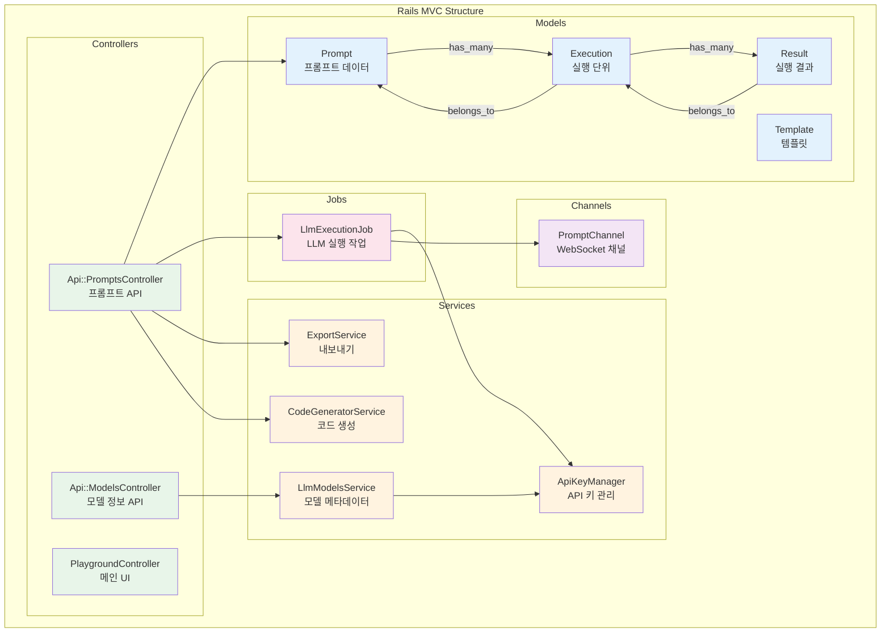
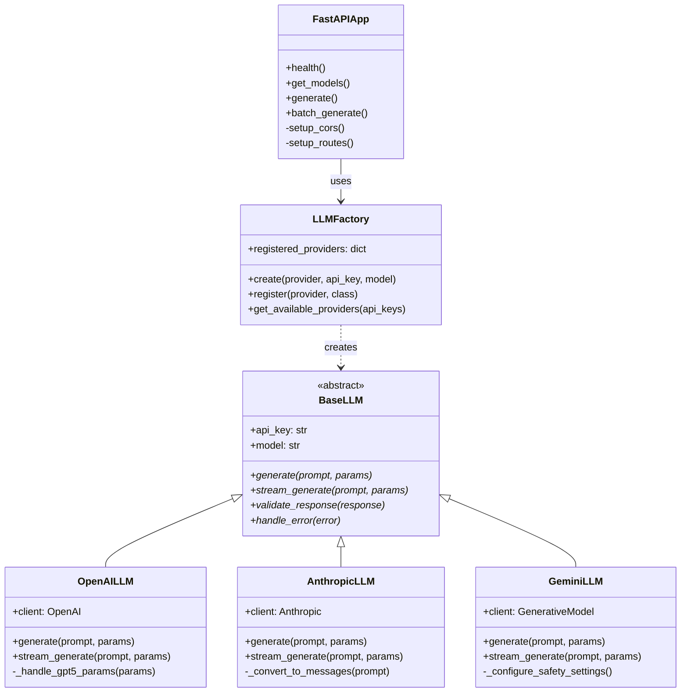
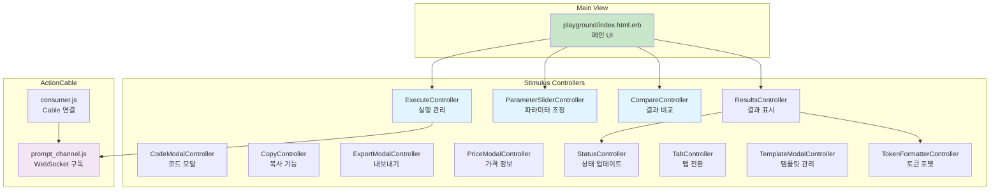
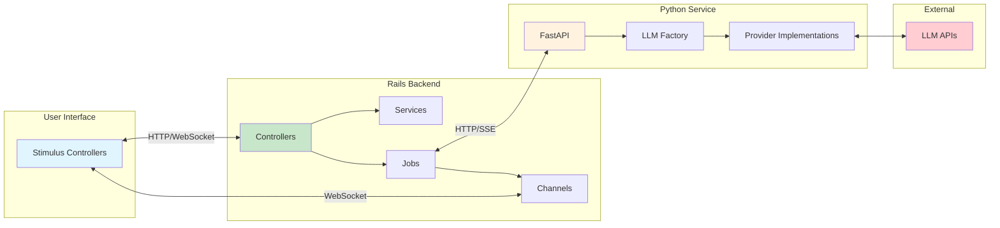

# 컴포넌트 구조

## 개요

LLM API Playground의 컴포넌트 구조를 계층별로 보여주는 다이어그램입니다. Rails MVC, FastAPI 서비스, Frontend 컴포넌트의 구조를 시각화합니다.

## 다이어그램

### Rails 애플리케이션 구조

### FastAPI 서비스 구조

### Frontend 컴포넌트 구조

### 데이터 흐름 관계도

## 설명

### Rails 컴포넌트
- **Controllers**: API 엔드포인트와 라우팅 처리
- **Models**: Active Record 모델로 데이터베이스 상호작용
- **Services**: 비즈니스 로직 캡슐화
- **Jobs**: Active Job을 통한 비동기 처리
- **Channels**: ActionCable을 통한 실시간 통신

### FastAPI 컴포넌트
- **BaseLLM**: 모든 LLM Provider의 추상 클래스
- **LLMFactory**: Provider 인스턴스 생성 팩토리
- **Provider Implementations**: 각 LLM 서비스별 구현체
- **FastAPIApp**: HTTP 엔드포인트와 CORS 설정

### Frontend 컴포넌트
- **Stimulus Controllers**: UI 상호작용 및 상태 관리
- **ActionCable**: WebSocket 통신 관리
- **Views**: ERB 템플릿 기반 UI 렌더링

## 참고사항

- Stimulus는 HTML 요소에 직접 바인딩되는 경량 JavaScript 프레임워크
- 각 Controller는 특정 UI 기능을 담당하며 data-controller 속성으로 연결
- Services는 테스트 가능하고 재사용 가능한 비즈니스 로직 제공
- Factory 패턴을 통해 새로운 LLM Provider 추가가 용이함
