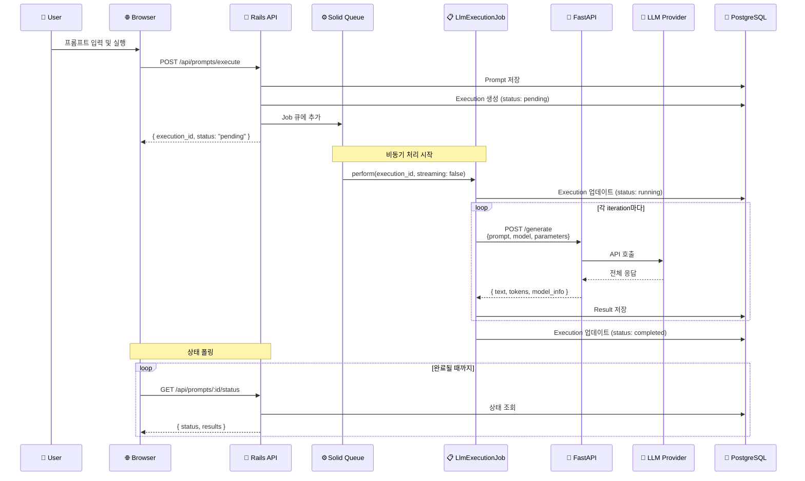
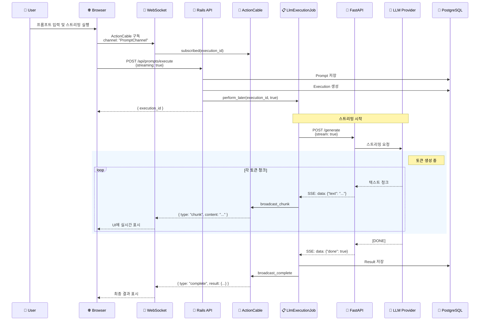
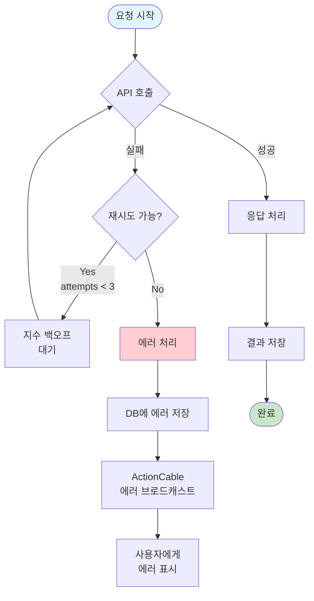

# 데이터 플로우

## 개요

LLM API Playground의 데이터 흐름을 보여주는 다이어그램입니다. 비스트리밍 모드와 스트리밍 모드의 요청-응답 플로우를 시각화합니다.

## 다이어그램

### 비스트리밍 요청 플로우

### 스트리밍 요청 플로우

### 에러 처리 플로우

## 설명

### 비스트리밍 모드
1. 사용자가 프롬프트를 실행하면 Rails API가 요청을 받음
2. Prompt와 Execution을 DB에 저장하고 백그라운드 Job 생성
3. Job이 FastAPI를 통해 LLM Provider 호출
4. 전체 응답을 받아 DB에 저장
5. 브라우저는 폴링으로 상태를 확인

### 스트리밍 모드
1. WebSocket 연결 먼저 설정 (ActionCable 구독)
2. 실행 요청 시 streaming: true 파라미터 전달
3. FastAPI가 SSE로 LLM 응답을 스트리밍
4. 각 청크를 ActionCable로 실시간 브로드캐스트
5. 브라우저에서 토큰이 생성되는 대로 표시

### 에러 처리
- 최대 3회 재시도 (지수 백오프)
- 실패 시 에러를 DB에 저장하고 사용자에게 알림
- Gemini 안전 필터 등 특수 에러 처리

## 참고사항

- SSE (Server-Sent Events): FastAPI → Rails 간 스트리밍
- WebSocket: Rails → Browser 간 실시간 통신
- 폴링은 비스트리밍 모드에서만 사용 (1초 간격)
- 모든 통신은 JSON 형식으로 이루어짐
