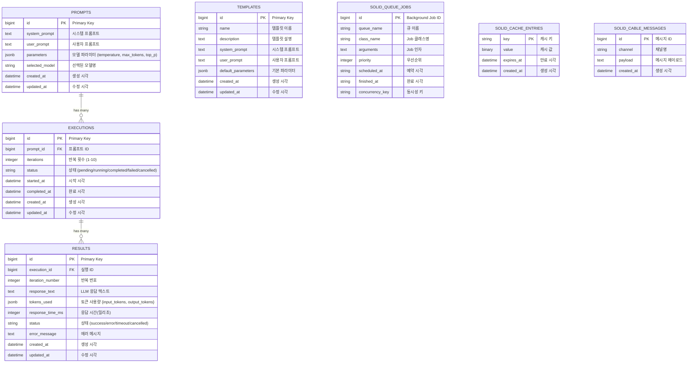

# 데이터베이스 스키마

## 개요

LLM API Playground의 데이터베이스 스키마를 보여주는 ERD(Entity Relationship Diagram)입니다. PostgreSQL 데이터베이스의 테이블 구조와 관계를 시각화합니다.

## 다이어그램



## 테이블 상세 설명

### PROMPTS 테이블
프롬프트 정보를 저장하는 핵심 테이블
- **parameters**: JSON 형태로 temperature, max_tokens, top_p 등 저장
- **selected_model**: 'gpt-4o', 'claude-3-5-haiku' 등 모델명

### EXECUTIONS 테이블
프롬프트 실행 단위를 관리
- **status**: 실행 상태 추적
  - pending: 대기 중
  - running: 실행 중
  - completed: 완료
  - failed: 실패
  - cancelled: 취소됨
- **iterations**: 동일 프롬프트 반복 실행 횟수

### RESULTS 테이블
각 실행의 결과를 저장
- **tokens_used**: `{input_tokens: 150, output_tokens: 500}` 형태
- **response_time_ms**: 응답 시간 측정
- **error_message**: 실패 시 상세 에러 정보

### TEMPLATES 테이블
재사용 가능한 프롬프트 템플릿
- **default_parameters**: 템플릿별 기본 파라미터 설정

### SOLID_QUEUE_JOBS 테이블
Rails 8의 Solid Queue 백그라운드 작업
- Active Job 어댑터로 사용
- LLM 실행 작업 관리

### SOLID_CACHE_ENTRIES 테이블
Rails 캐싱 레이어
- 모델 메타데이터 캐싱
- API 응답 캐싱

### SOLID_CABLE_MESSAGES 테이블
ActionCable 메시지 저장소
- WebSocket 메시지 영속성

## 인덱스 전략

```sql
-- 자주 사용되는 쿼리를 위한 인덱스
CREATE INDEX idx_executions_prompt_id ON executions(prompt_id);
CREATE INDEX idx_executions_status ON executions(status);
CREATE INDEX idx_results_execution_id ON results(execution_id);
CREATE INDEX idx_results_execution_iteration ON results(execution_id, iteration_number);
CREATE INDEX idx_prompts_created_at ON prompts(created_at DESC);
CREATE INDEX idx_templates_name ON templates(name);

-- JSONB 필드를 위한 GIN 인덱스
CREATE INDEX idx_prompts_parameters ON prompts USING gin(parameters);
CREATE INDEX idx_results_tokens ON results USING gin(tokens_used);
```

## 데이터 타입 매핑

| PostgreSQL Type | Rails Type | 설명 |
|----------------|------------|------|
| bigint | :bigint | Primary/Foreign Keys |
| text | :text | 긴 텍스트 (프롬프트, 응답) |
| string | :string | 짧은 문자열 (상태, 모델명) |
| jsonb | :jsonb | 구조화된 데이터 (파라미터, 토큰) |
| integer | :integer | 숫자 (반복 횟수, 응답 시간) |
| datetime | :datetime | 시간 정보 |
| binary | :binary | 캐시된 바이너리 데이터 |

## 참고사항

- JSONB 타입을 활용하여 유연한 스키마 설계
- Solid Queue/Cache/Cable 테이블은 Rails 8의 내장 기능
- 모든 테이블에 created_at, updated_at 타임스탬프 포함
- 외래 키 제약으로 데이터 무결성 보장
- 적절한 인덱스로 쿼리 성능 최적화
