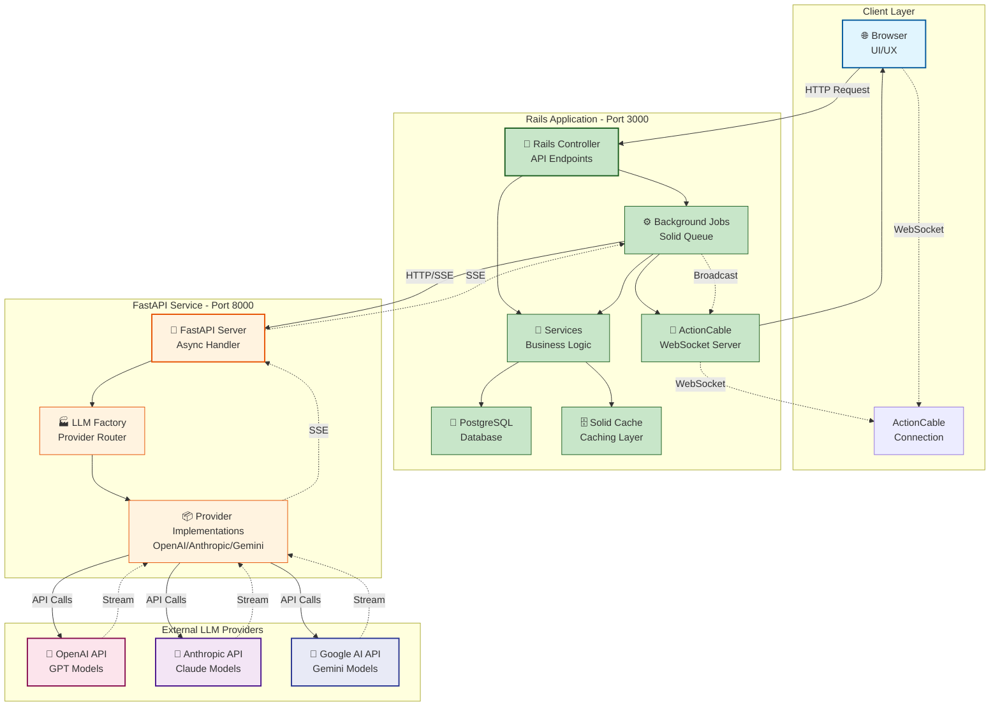

# 시스템 아키텍처

## 개요

LLM API Playground의 전체 시스템 아키텍처를 보여주는 다이어그램입니다. Rails 애플리케이션이 중심이 되어 FastAPI 서비스와 통신하며, 다양한 LLM Provider들과 연동합니다.

## 다이어그램

## 설명

### 각 컴포넌트 설명

#### Client Layer
- **Browser**: 사용자 인터페이스를 제공하는 웹 브라우저
- **ActionCable Connection**: 실시간 통신을 위한 WebSocket 연결

#### Rails Application (Port 3000)
- **Rails Controller**: RESTful API 엔드포인트 제공
  - `/api/prompts/execute`: 프롬프트 실행
  - `/api/prompts/:id/status`: 실행 상태 확인
  - `/api/models`: 사용 가능한 모델 목록
- **PostgreSQL Database**: 프롬프트, 실행 기록, 결과 데이터 저장
- **Background Jobs (Solid Queue)**: 비동기 작업 처리
- **ActionCable**: WebSocket을 통한 실시간 업데이트
- **Services**: 비즈니스 로직 캡슐화
- **Solid Cache**: 응답 캐싱 및 성능 최적화

#### FastAPI Service (Port 8000)
- **FastAPI Server**: 비동기 HTTP 서버, CORS 설정
- **LLM Factory**: API 키 기반 Provider 라우팅
- **Provider Implementations**: 각 LLM SDK를 래핑한 구현체

#### External LLM Providers
- **OpenAI API**: GPT-4o, GPT-5 모델 제공
- **Anthropic API**: Claude 3.5 시리즈 모델 제공
- **Google AI API**: Gemini 2.5 시리즈 모델 제공

### 데이터 흐름

1. **일반 요청 흐름** (실선)
   - Browser → Rails Controller → Background Job → FastAPI → LLM Provider

2. **스트리밍 응답 흐름** (점선)
   - LLM Provider → FastAPI (SSE) → Rails Job → ActionCable → Browser

## 참고사항

- Rails와 FastAPI는 독립적으로 배포 가능한 마이크로서비스 구조
- 모든 LLM API 호출은 FastAPI를 통해 중앙화되어 관리
- WebSocket과 SSE를 조합하여 실시간 스트리밍 구현
- Solid Queue, Cable, Cache를 활용한 Rails 8의 최신 기능 적용
